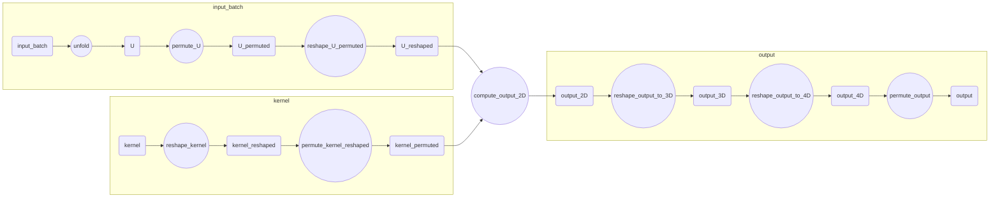

## Convolutional Neural Networks

### Convolution 2D diagram

The custom vectorized Conv2D has been implemented in [conv2d_vectorized.ipynb](./conv2d_vectorized.ipynb)

```mermaid
graph LR
  A(input_batch)
  B(U)
  C(U_permuted)
  D(U_reshaped)
  E(kernel)
  F(kernel_reshaped)
  G(kernel_permuted)
  H(output_2D)
  I(output_3D)
  J(output_4D)
  K(output)

  L((unfold))
  M((permute_U))
  N((reshape_U_permuted))
  O((reshape_kernel))
  T((permute_kernel_reshaped))
  P((compute_output_2D))
  Q((reshape_output_to_3D))
  R((reshape_output_to_4D))
  S((permute_output))

  subgraph input_batch
    A --> L --> B
    B --> M --> C
    C --> N --> D
  end

  subgraph kernel
    E --> O --> F
    F --> T --> G
  end

  D --> P
  G --> P
  P --> H
  subgraph output
    H --> Q --> I
    I --> R --> J
    J --> S --> K
  end

```
